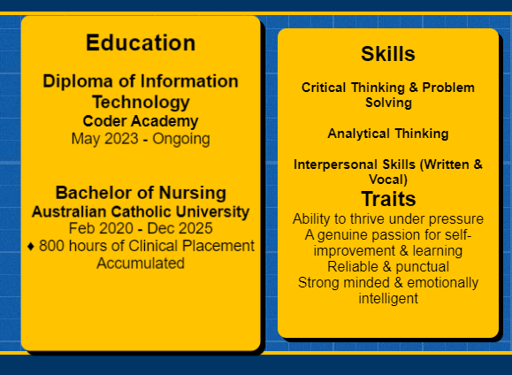
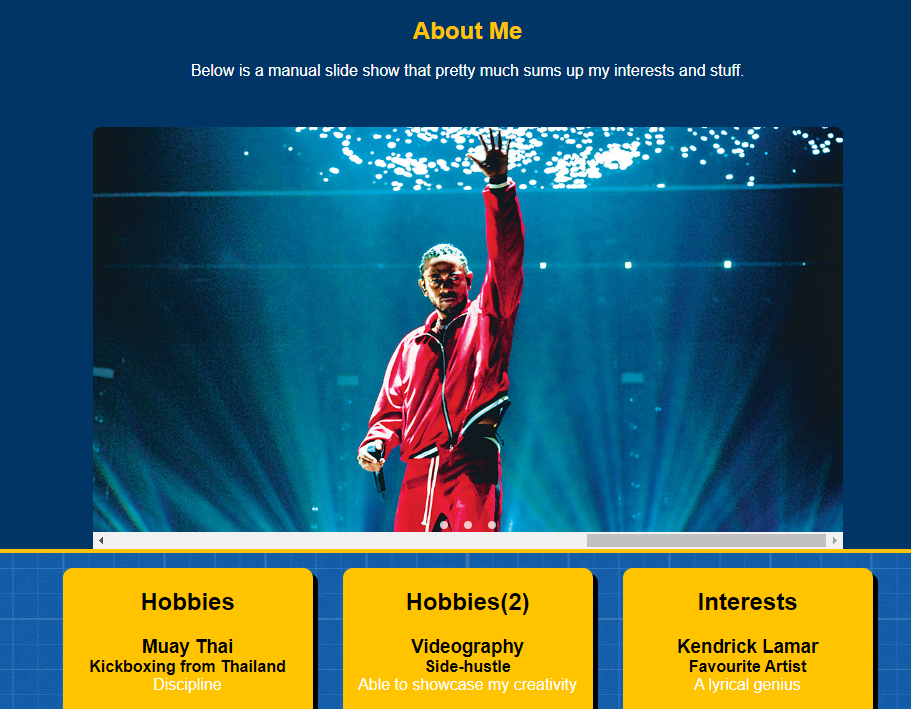
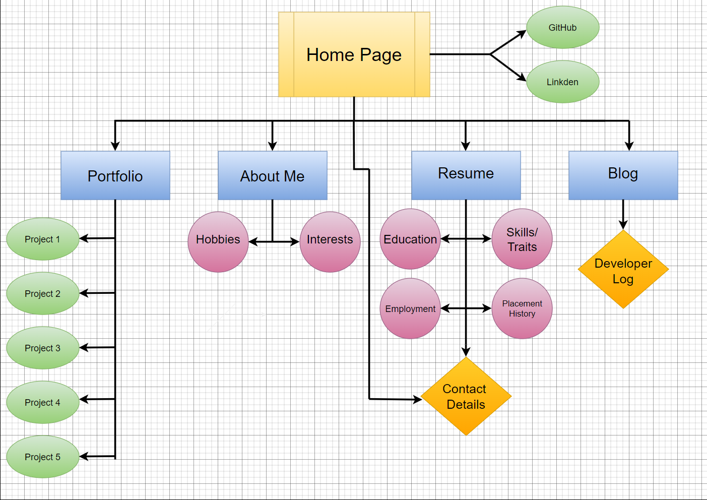
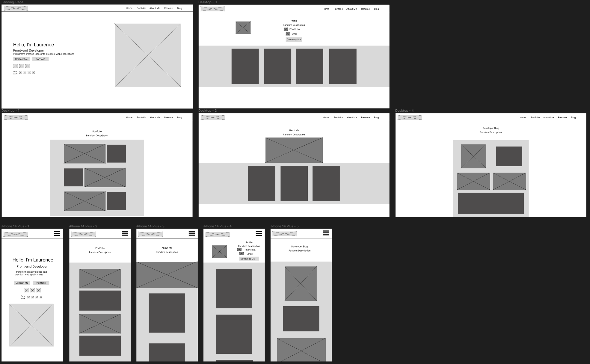

# Laurence Rico A1T2 Project : Portfolio Website
## __Links__ : 
### URL to Portfolio Website : www. 
### GitHub Repository : www.
### Presentation Video : www. 

 

## __Tech Stack__ : 

* HTML5
* CSS-3
 

## __Descriptions__ :  

 

__Purpose__

The aim of this project is to create a personal portfolio website showcasing my ability to create front-end web applications. The website itself as well as the portfolio page which showcases my (fake) projects are the vital features of this project which employers will be predominantly focusing on. Therefore, I aimed to keep my landing-page and portfolio page as minimal and readable as possible. In knowing this I attempted to capture attention in the other pages of my portfolio through colourful graphics and special features. This enabled me to exercise my flexbox abilities and dabble around with animations and transitions to create an image slider on my about me page.

__Target Audience__

__Functionality & Features__

Time constraints prevented me from implementing any high quality animations and transitions, which was disappointing considering it was intended from the beginning of my project. However, I was able to implement a few. The buttons "Contact Me", "View Portfolio" and "Download CV" as seen on my Landing page and Resume page have a unique hover animation which slides the contrasting color over. The "panels" or "tabs" containing the text in my About me page and Resume page have a simple transform animation on hover. 

Lastly the most unique feature of my portfolio, is the image slider on my about me page. This slider can be controlled by either the navigation buttons seen at the bottom of the slider container, or the by the default slider as shown on windows.

__Sitemap__

Your standard Sitemap

__Wireframe__

